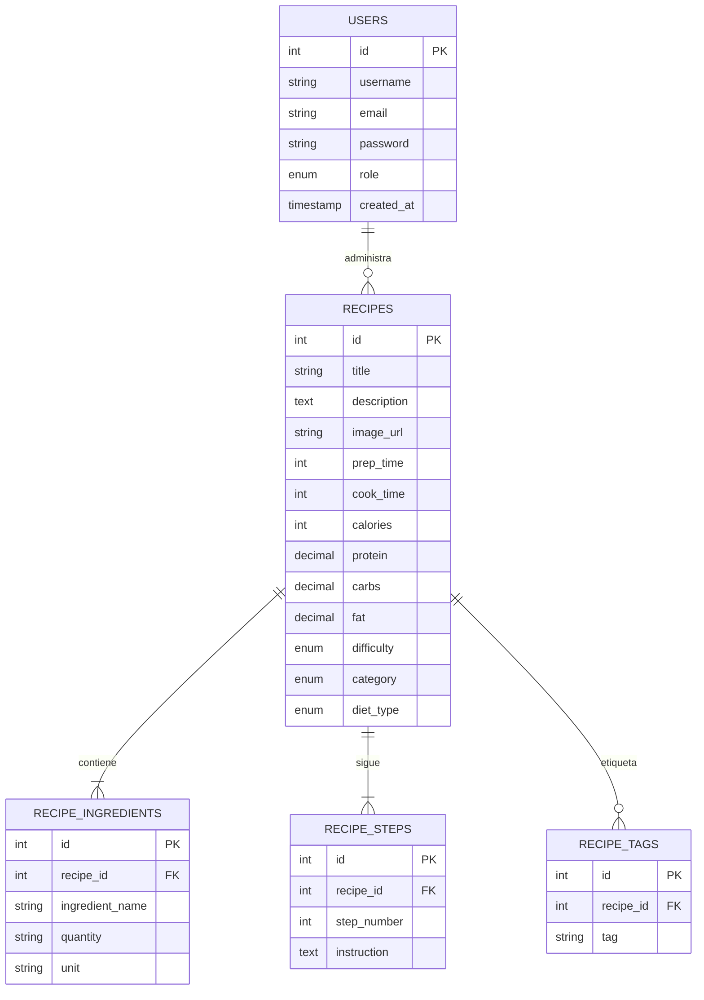

# Documentación Técnica NutriFit 🍃

**NutriFit** es una plataforma integral de nutrición y bienestar diseñada para ayudar a los usuarios a alcanzar sus objetivos de salud mediante planes de alimentación personalizados, una base de datos de recetas saludables y herramientas de cálculo nutricional avanzado.

---

## 1. Visión General y Objetivos

### 1.1 ¿Qué es NutriFit?
NutriFit es una aplicación web full-stack que combina la gestión de contenidos (recetas) con lógica de negocio inteligente (generador de planes de comidas). Está enfocada tanto en usuarios finales que buscan mejorar su alimentación como en administradores que gestionan la comunidad.

### 1.2 Objetivos del Proyecto
*   **Personalización**: Ofrecer planes nutricionales basados en datos biométricos reales (peso, altura, edad, actividad).
*   **Accesibilidad**: Proporcionar recetas filtrables por tipo de dieta (vegano, vegetariano, omnívoro) y alergias (gluten, lactosa, etc.).
*   **Gestión Eficiente**: Permitir a los administradores gestionar el catálogo de recetas y la base de usuarios de forma centralizada.
*   **Educación Nutricional**: Desglosar macronutrientes (proteínas, carbohidratos, grasas) y calorías de cada plato.

---

## 2. Arquitectura Tecnológica (Stack)

La aplicación sigue una arquitectura desacoplada con un frontend moderno y una API RESTful.

*   **Frontend**: React.js (Vite) + CSS Moderno + Framer Motion (Animaciones).
*   **Backend**: Node.js + Express.js.
*   **Base de Datos**: MySQL.
*   **Autenticación**: JSON Web Tokens (JWT) y cifrado de contraseñas con bcrypt.

---

## 3. Modelo de Datos (Base de Datos)

El esquema de la base de datos está diseñado para soportar una alta flexibilidad en la definición de recetas y restricciones dietéticas.

### 3.1 Diagrama de Entidad-Relación (Simplificado)



---

## 4. Funcionalidades Principales

### 4.1 Calculadora Nutricional e IA de Planes
La joya de la corona de NutriFit. Permite al usuario introducir sus datos y obtener:
*   **TMB (Tasa Metabólica Basal)** y **TDEE (Gasto Energético Total Diario)**.
*   **Distribución de Macros** ajustada a objetivos: *Mantenimiento, Volumen o Definición*.
*   **Generador de Plan Diario**: Selecciona automáticamente un Desayuno, Comida, Cena y Snack que se ajusten a las calorías objetivo, respetando alergias y tipo de dieta.

### 4.2 Explorador de Recetas
Un catálogo dinámico con:
*   Búsqueda por texto.
*   Filtros avanzados: Categoría (Desayuno/Comida/Cena/Snack), Tipo de Dieta, Dificultad y Límite de Calorías.
*   Exclusión de Alergias: Filtra recetas que contengan etiquetas de alérgenos seleccionados.

### 4.3 Panel de Administración
Acceso restringido para:
*   **Dashboard**: Estadísticas en tiempo real (Total usuarios, recetas, platos veganos).
*   **CRUD de Recetas**: Interfaz completa para crear, editar y eliminar recetas con sus ingredientes y pasos paso a paso.
*   **Gestión de Usuarios**: Listado y control de acceso a la plataforma.

---

## 5. Documentación de la API (Endpoints)

La API base se encuentra en `/api`. Todas las respuestas son en formato JSON.

### 5.1 Autenticación (`/api/auth`)
| Método | Endpoint | Descripción | Requisitos |
| :--- | :--- | :--- | :--- |
| `POST` | `/login` | Inicia sesión y devuelve el token JWT. | `username`, `password` |
| `POST` | `/register` | Registra un nuevo usuario (`role: user`). | `username`, `email`, `password` |
| `GET` | `/me` | Obtiene los datos del usuario autenticado. | Token JWT |

### 5.2 Recetas (`/api/recipes`)
| Método | Endpoint | Descripción | Filtros Query |
| :--- | :--- | :--- | :--- |
| `GET` | `/` | Lista de recetas con filtros opcionales. | `diet_type`, `category`, `search`, `max_calories`, `tags_exclude` |
| `GET` | `/:id` | Detalle completo de una receta (incluye ingredientes y pasos). | `id` |

### 5.3 Calculadora (`/api/calculator`)
| Método | Endpoint | Descripción | Body (JSON) |
| :--- | :--- | :--- | :--- |
| `POST` | `/` | Calcula macros y genera un plan de comidas. | `peso`, `altura`, `edad`, `actividad`, `objetivo`, `diet_type`, `allergies` |

### 5.4 Administración (`/api/admin`)
*Requiere `role: admin`*
| Método | Endpoint | Descripción |
| :--- | :--- | :--- |
| `GET` | `/stats` | Estadísticas globales del sitio. |
| `GET` | `/recipes` | Listado administrativo de recetas. |
| `POST` | `/recipes` | Crea una nueva receta completa. |
| `PUT` | `/recipes/:id` | Actualiza una receta existente. |
| `DELETE` | `/recipes/:id` | Elimina una receta. |
| `GET` | `/users` | Listado de usuarios registrados. |

---

## 6. Instalación y Configuración

### 6.1 Requisitos Previos
*   Node.js (v16+)
*   MySQL Server
*   NPM o Yarn

### 6.2 Pasos de Configuración
1.  **Base de Datos**: Importar el archivo `sql/nutrifit.sql` en tu gestor MySQL.
2.  **Variables de Enorno**: Configurar el archivo `.env` en la carpeta `backend/`:
    ```env
    PORT=3001
    DB_HOST=localhost
    DB_USER=root
    DB_PASS=tu_password
    DB_NAME=nutrifit
    JWT_SECRET=tu_clave_secreta_super_segura
    ```
3.  **Backend**:
    ```bash
    cd backend
    npm install
    npm start
    ```
4.  **Frontend**:
    ```bash
    cd frontend
    npm install
    npm run dev
    ```

---

## 7. Conclusión
NutriFit representa una solución robusta y escalable para la gestión nutricional. Su arquitectura modular permite futuras expansiones, como la integración con dispositivos wearables o la creación de una comunidad social de recetas.

---
*Documentación generada para el Proyecto Final DAW 2025-2026.*

